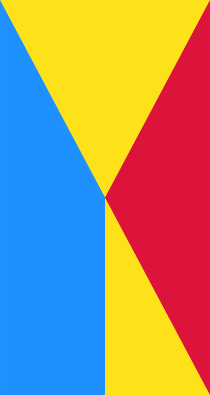

# Procesverslag
**Auteur:** -jouw naam-

Markdown cheat cheet: [Hulp bij het schrijven van Markdown](https://github.com/adam-p/markdown-here/wiki/Markdown-Cheatsheet). Nb. de standaardstructuur en de spartaanse opmaak zijn helemaal prima. Het gaat om de inhoud van je procesverslag. Besteedt de tijd voor pracht en praal aan je website.

## Bronnenlijst
1. -bron 1-
2. -bron 2-
3. -...-

## Eindgesprek (week 7/8)

-dit ging goed & dit was lastig-

**Screenshot(s):**

-screenshot(s) van je eindresultaat-

## Voortgang 3 (week 6)

| Samantha(ik)                                        | Noa                                                     | Nicole                                | Maylinn          | Stein         |
| ---                                                 | ---                                                     | ---                                   | ---              | ---           |
| Hoe kan je slomer scrollen?                         | Hoe krijg ik mijn menu over de rest van de content?     | Mag ik ook andere iconen gebruiken?   | geen vraag       | Geen vraag    |
| scrollbar weghalen en laten werken op desktop       | ---                                                     | ---                                   | ---              | ---           |
| js pathname voor code inladen werkt niet online     | ---                                                     | ---                                   | ---              | ---           |

## Voortgang 2 (week 5)
De nav is gefixt en ik ben begonnen aan het hamburger menu. Ook heb ik een timer bij de dagdeal toegevoegd. Het gaat wel goed.

**Screenshot(s):**

| Samantha                                                                       | Noa                | Nicole       | Maylinn          | Stein         |
| ---                                                                                | ---                | ---          | ---              | ---           |
| Hoe zorg ik er voor dat mijn animatie bij 10 graden begint? | Hoe maak ik een hamburger menu? |Wat is frontend?  | Ik heb een vraag over de scaling van de tekst en de video              | Geen vraag|
| ---                                                                                | Vraag over pijltjes bij verschillende sections               | ---          | ---              | ---           |

## Voortgang 1 (week 3)

### Stand van zaken
De nav is nog niet helemaal zoals ik wil, maar de rest gaat op zich wel goed. Ik ben nog niet echt bezig geweest met het goed positioneren van tekst over de afbeeldingen heen, maar dat komt nog wel.  

**Screenshot(s):**

### Agenda voor meeting
| Samantha                                                                       | Noa                | Nicole       | Maylinn          | Stein         |
| ---                                                                                | ---                | ---          | ---              | ---           |
| Hoe zorg ik er voor dat de achtergrondkleur verandert als een element in beeld is? | Ik heb een vraag over mijn header |Hoe krijg ik ruimte tussen mijn scrollbar?  | Hoe maak je een achtergrond gradient met stipjes?              | Ik heb een vraag over mijn header|
| In hoeverre is dit de surface plane/wat moet er bij?                               | ---                |Hoe krijg ik ruimte onder mijn button?      | Hoe krijg ik mijn header fixed?                 | ---            |
| ---                                                                                | ---                | ---          | Hoe krijg ik sommige dingen responsive  | ---           |

### Verslag van meeting
De meeting ging wel goed. Mijn vraag werd niet direct beantwoordt, maar ik kreeg daarna een beginnetje waarna ik het probleem heb kunnen oplossen.

## Breakdownschets (week 1)

-uitwerken voor de 1e werkgroep - eind van de eerste week-

## Intake (week 1)

**Je startniveau:** rood

**Je focus:** responsive

**Je opdracht:** https://www.bol.com/nl/

**Screenshot(s) van de eerste pagina (small screen):**

**Screenshot(s) van de tweede pagina (small screen):**

